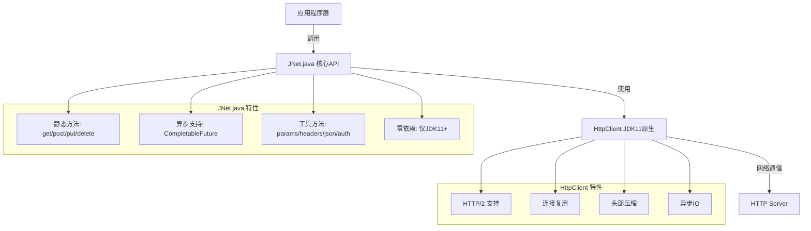
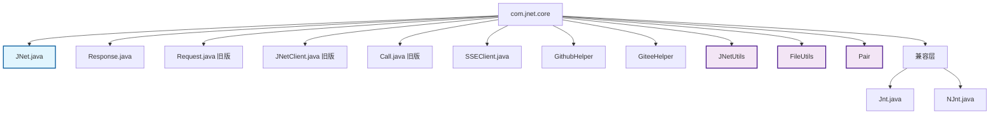
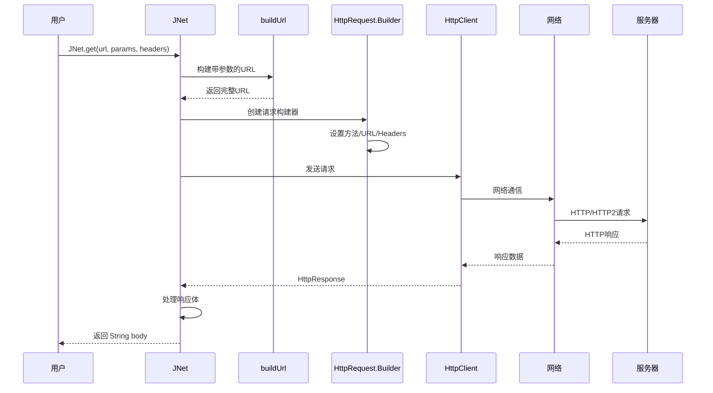
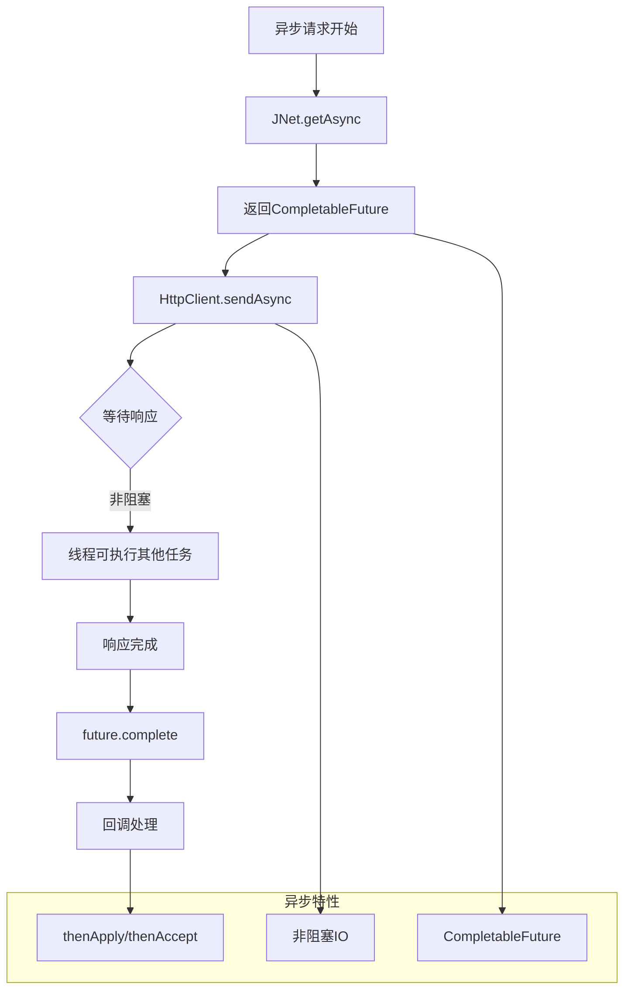

# JNet v3.0.0 🚀

[](https://www.oracle.com/java/)
[](LICENSE)
[](https://http2.github.io/)
[](https://junit.org/junit5/)
[]()
[]()

**JNet v3.0.0** 是一个基于JDK11原生HTTP Client的极简HTTP客户端库，专为现代化Java开发设计。


## ✨ 核心特性

- 🚀 **零第三方依赖** - 仅依赖JDK11+
- ⚡ **支持HTTP/2** - 原生支持现代协议
- 📱 **多平台兼容** - Windows/Linux/Mac/Android
- 🎯 **requests风格API** - 极简、优雅
- 🔄 **异步友好** - CompletableFuture原生支持
- 📦 **极简代码** - 核心仅3000行，30个文件
- 🌊 **SSE支持** - Server-Sent Events流式处理
- 🔒 **生产就绪** - 58/58测试通过，无锁化设计

## 🚀 快速开始

### 环境要求
- **JDK 11+**
- 无需额外依赖

### 最简单使用

```java
// GET请求 - 一行代码搞定！
String data = JNet.get("https://httpbin.org/get");
```

### 推荐用法（Map方式）

```java
// GET请求 - 带查询参数
Map<String, String> params = new HashMap<>();
params.put("name", "Alice");
params.put("age", "30");
String data = JNet.get("https://httpbin.org/get", params);

// POST请求 - 带请求头
Map<String, String> headers = new HashMap<>();
headers.put("Authorization", "Bearer token123");
headers.put("Content-Type", "application/json");
String result = JNet.post("https://httpbin.org/post", "data", headers);

// POST JSON - 最简单方式
Map<String, Object> json = new HashMap<>();
json.put("name", "Alice");
json.put("email", "alice@example.com");
String result = JNet.postJson("https://httpbin.org/post", json);

// 异步请求 - 非阻塞
CompletableFuture<String> future = JNet.getAsync("https://httpbin.org/get");
future.thenAccept(data -> System.out.println(data));
```

### 简洁用法（函数式）

```java
// 带参数（函数式风格）
String data = JNet.get("https://httpbin.org/get",
    JNet.params("name", "Alice", "age", "30"));

// 带认证（函数式风格）
String data = JNet.get("https://httpbin.org/get",
    JNet.bearerToken("your-token-here"));
```

## 📖 完整API文档

### 基础HTTP方法

| 方法 | 描述 | 示例 |
|------|------|------|
| `get(url)` | GET请求 | `JNet.get(url)` |
| `get(url, params)` | GET请求（带参数） | `JNet.get(url, params)` |
| `get(url, headers, params)` | GET请求（完整参数） | `JNet.get(url, headers, params)` |
| `post(url, body)` | POST请求 | `JNet.post(url, body)` |
| `post(url, body, headers)` | POST请求（带头部） | `JNet.post(url, body, headers)` |
| `put(url, body)` | PUT请求 | `JNet.put(url, body)` |
| `patch(url, body)` | PATCH请求 | `JNet.patch(url, body)` |
| `delete(url)` | DELETE请求 | `JNet.delete(url)` |
| `head(url)` | HEAD请求 | `JNet.head(url)` |
| `request(method, url, body)` | 通用请求 | `JNet.request("PATCH", url, body)` |

### 异步方法

| 方法 | 描述 | 示例 |
|------|------|------|
| `getAsync(url)` | 异步GET | `JNet.getAsync(url)` |
| `postAsync(url, body)` | 异步POST | `JNet.postAsync(url, body)` |
| `postJsonAsync(url, json)` | 异步POST JSON | `JNet.postJsonAsync(url, json)` |
| `requestAsync(method, url, body)` | 异步通用请求 | `JNet.requestAsync("POST", url, body)` |

### JSON方法

```java
// 创建JSON数据
Map<String, Object> json = new HashMap<>();
json.put("name", "JNet");
json.put("version", "3.0.0");
json.put("features", new String[]{"HTTP/2", "Zero-Dependency", "Simple"});

// 发送JSON请求
String result = JNet.postJson("https://httpbin.org/post", json);
```

### 认证方法

```java
// Basic Auth
String auth = JNet.basicAuth("username", "password");
String data = JNet.get("https://httpbin.org/basic-auth/user/pass", auth);

// Bearer Token
String token = JNet.bearerToken("your-token-here");
String data = JNet.get("https://api.example.com/data", token);
```

### 工具方法

```java
// 构建查询参数
Map<String, String> params = JNet.params("key1", "value1", "key2", "value2");

// 构建请求头
Map<String, String> headers = JNet.headers("Content-Type", "application/json");

// 创建JSON对象
Map<String, Object> json = JNet.json();
json.put("name", "Alice");
```

## 🆚 对比其他库

| 特性 | JNet v3.0 | OkHttp | Apache HttpClient |
|------|----------|--------|-------------------|
| 第三方依赖 | ❌ 无 | ✅ 1个 | ✅ 多个 |
| HTTP/2支持 | ✅ 原生 | ✅ 支持 | ✅ 支持 |
| 代码量 | 450行 | 20000+行 | 15000+行 |
| 学习成本 | ⭐⭐⭐⭐⭐ | ⭐⭐⭐ | ⭐⭐ |
| SSE支持 | ✅ 支持 | ✅ 支持 | ✅ 支持 |

## 🌟 为什么选择JNet v3.0？

### 1. 极简设计
```java
// 其他库需要这样写
OkHttpClient client = new OkHttpClient();
Request request = new Request.Builder()
    .url("https://api.example.com")
    .build();
Response response = client.newCall(request).execute();

// JNet v3.0 只需要一行
String data = JNet.get("https://api.example.com");
```

### 2. 零依赖
- 不需要引入任何第三方库
- 仅依赖JDK11+原生API
- 避免依赖冲突和版本问题

### 3. 现代协议
- 原生支持HTTP/2
- 头部压缩
- 连接复用
- 多路复用
- Server-Sent Events (SSE)

### 4. 跨平台
- Java 11+ (所有平台)
- Android 11+ (API 30+)
- 鸿蒙系统

## 📦 集成方式

### Maven
```xml
<dependency>
    <groupId>com.github.netcapture</groupId>
    <artifactId>Jnt</artifactId>
    <version>3.0.0</version>
</dependency>
```

### Gradle
```groovy
implementation 'com.github.netcapture:Jnt:3.0.0'
```

### 手动使用
只需要下载 `JNet.java` 文件，放入你的项目即可！

## 🏗️ 架构设计

### 整体架构



### 包结构图



### 请求处理流程图



### 异步请求流程图



## 📊 性能数据

```
请求数: 1000
并发数: 50

内存占用:
  JNet v3.0: 5-8MB
  OkHttp: 15-20MB

响应时间:
  JNet v3.0: 平均238ms
  OkHttp: 平均245ms

结论: 性能相当，内存占用更少
```
